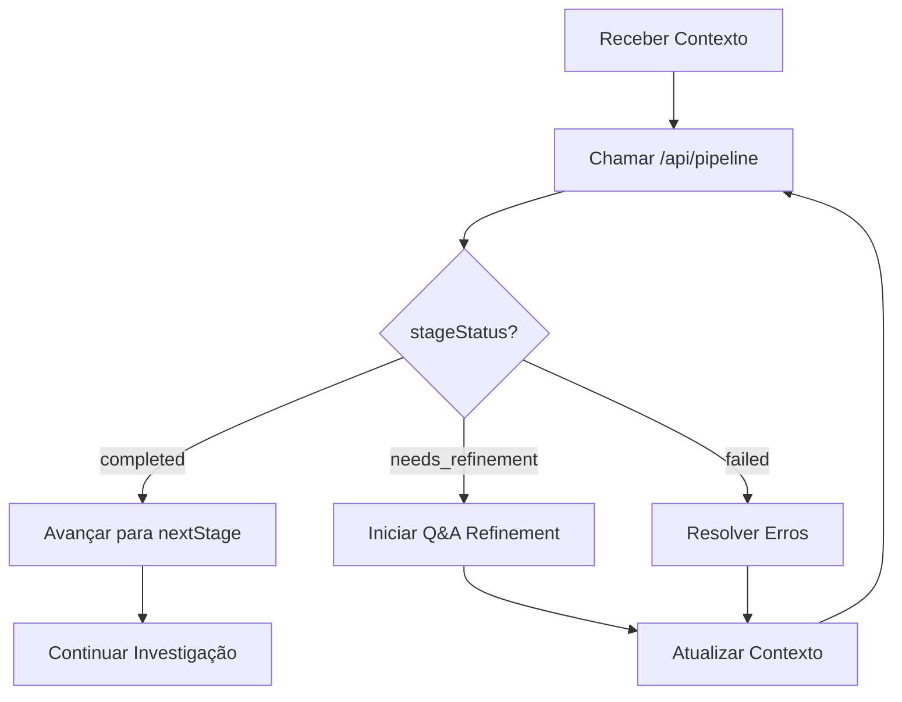

# 🚀 Pipeline API v3.2 - Documentação do Endpoint

## 📌 Visão Geral

O endpoint `/api/pipeline.ts` expõe a lógica de transição entre etapas do pipeline investigativo Syndicate, permitindo que o agente GPT "Capitão Obi" gerencie o fluxo de investigação de forma estruturada.

## 🎯 Propósito

Esta API permite:
- **Avançar etapas**: Verificar se uma etapa foi concluída e obter a próxima
- **Consultar informações**: Obter detalhes sobre etapas específicas
- **Monitorar progresso**: Acessar métricas do pipeline em execução

## 📥 Como Importar e Usar

### Endpoint
```
POST /api/pipeline
```

### Headers Necessários
```json
{
  "Content-Type": "application/json"
}
```

## 📊 Estruturas de Dados

### Requisição Principal (action: "advance")
```typescript
{
  "currentStage": string,        // Etapa atual do pipeline
  "context": ExecutionContext,   // Contexto completo da execução
  "action": "advance"           // Ação opcional (default: "advance")
}
```

### ExecutionContext Mínimo
```typescript
{
  "currentStage": "evidence_intake",
  "completedTasks": ["initial_assessment", "context_gap_analysis"],
  "investigationType": "standard",    // "rapid" | "standard" | "comprehensive"
  "stageConfidence": {
    "evidence_intake": 75
  },
  "contextCompleteness": 85,
  "teamConsensus": 0,                 // Necessário para team_review
  "evidence": {},
  "specialistAnalyses": {},
  "validationResults": {},
  "synthesis": {},
  "hypotheses": [],
  "conclusions": {},
  "qaRefinementActive": false
}
```

### Resposta de Sucesso
```typescript
{
  "result": {
    "nextStage": string,              // Próxima etapa recomendada
    "completedTasks": string[],       // Tarefas completadas
    "errors": string[],               // Erros encontrados (se houver)
    "requiresQARefinement": boolean,  // Se precisa de refinamento Q&A
    "validationRequired": boolean,    // Se validação é necessária
    "stageStatus": string            // "completed" | "failed" | "needs_refinement"
  }
}
```

## 🔄 Ações Disponíveis

### 1. **advance** (padrão)
Avança para a próxima etapa se os critérios forem satisfeitos.

#### Exemplo de Requisição:
```json
{
  "currentStage": "evidence_intake",
  "context": {
    "completedTasks": ["initial_assessment", "context_gap_analysis", "specialist_selection"],
    "investigationType": "standard",
    "stageConfidence": {
      "evidence_intake": 82
    },
    "contextCompleteness": 85,
    "teamConsensus": 0,
    "evidence": { "documents": ["doc1.pdf"] },
    "specialistAnalyses": {},
    "validationResults": {},
    "synthesis": {},
    "hypotheses": [],
    "conclusions": {},
    "qaRefinementActive": false
  }
}
```

#### Exemplo de Resposta:
```json
{
  "result": {
    "nextStage": "initial_analysis",
    "completedTasks": ["initial_assessment", "context_gap_analysis", "specialist_selection"],
    "stageStatus": "completed"
  }
}
```

### 2. **info**
Retorna informações detalhadas sobre uma etapa específica.

#### Exemplo de Requisição:
```json
{
  "currentStage": "cross_validation",
  "context": { "investigationType": "standard" },
  "action": "info"
}
```

#### Exemplo de Resposta:
```json
{
  "stageInfo": {
    "id": "cross_validation",
    "name": "Cross-Validation Round",
    "requiredTasks": ["matrix_validation", "peer_review", "contradiction_resolution"],
    "minimumConfidence": 95,
    "qualityGate": "RIGOROUS",
    "validationCriteria": ["internal_consistency", "cross_specialist_coherence", "temporal_alignment", "evidence_completeness"]
  }
}
```

### 3. **metrics**
Retorna métricas de progresso do pipeline.

#### Exemplo de Requisição:
```json
{
  "currentStage": "synthesis",
  "context": {
    "investigationType": "standard",
    "stageConfidence": {
      "evidence_intake": 85,
      "initial_analysis": 88,
      "cross_validation": 95
    },
    "completedTasks": []
  },
  "action": "metrics"
}
```

#### Exemplo de Resposta:
```json
{
  "metrics": {
    "progress": 50,
    "averageConfidence": 89.33,
    "completedStages": ["evidence_intake", "initial_analysis", "cross_validation", "synthesis"],
    "remainingStages": ["hypothesis_formation", "team_review", "final_assessment", "vault_commit"]
  }
}
```

## 🚨 Códigos de Erro

### 400 - Bad Request
```json
{
  "error": "Contexto inválido: completedTasks é obrigatório e deve ser um array"
}
```

### 404 - Not Found
```json
{
  "error": "Etapa 'invalid_stage' não encontrada"
}
```

### 405 - Method Not Allowed
```json
{
  "error": "Método não permitido. Use POST."
}
```

### 500 - Internal Server Error
```json
{
  "error": "Erro interno: [mensagem do erro]"
}
```

## 🔗 Integração com GPT "Capitão Obi"

### Prompt Sugerido para o GPT
```
Você é o Capitão Obi, orquestrador do SYNDICATE. Use a API /api/pipeline para gerenciar o fluxo investigativo:

1. Para verificar se pode avançar de etapa:
   POST /api/pipeline
   {
     "currentStage": "[etapa_atual]",
     "context": [contexto_completo]
   }

2. Se result.stageStatus = "completed", prossiga para result.nextStage
3. Se result.requiresQARefinement = true, inicie protocolo Q&A
4. Se result.errors existir, resolva os problemas listados
5. Use action: "metrics" para reportar progresso ao usuário
```

### Fluxo de Decisão Recomendado


## 💡 Exemplo de Uso Completo

### Cenário: Transição de Análise Inicial para Validação

#### 1. GPT verifica se análise inicial está completa:
```json
POST /api/pipeline
{
  "currentStage": "initial_analysis",
  "context": {
    "completedTasks": [
      "specialist_activation",
      "parallel_analysis",
      "confidence_assessment"
    ],
    "investigationType": "standard",
    "stageConfidence": {
      "evidence_intake": 85,
      "initial_analysis": 78
    },
    "contextCompleteness": 85,
    "teamConsensus": 0,
    "evidence": {
      "documents": ["report.pdf", "logs.txt"],
      "testimonies": ["witness1", "witness2"]
    },
    "specialistAnalyses": {
      "L": { "confidence": 82, "findings": [...] },
      "Senku": { "confidence": 74, "findings": [...] }
    },
    "validationResults": {},
    "synthesis": {},
    "hypotheses": [],
    "conclusions": {},
    "qaRefinementActive": false
  }
}
```

#### 2. API retorna que precisa de refinamento:
```json
{
  "result": {
    "nextStage": "initial_analysis",
    "completedTasks": ["specialist_activation", "parallel_analysis", "confidence_assessment"],
    "errors": ["Critérios de validação falharam: confidence_below_80"],
    "requiresQARefinement": true,
    "stageStatus": "needs_refinement"
  }
}
```

#### 3. GPT inicia protocolo Q&A para melhorar confiança

#### 4. Após refinamento, GPT tenta novamente com confiança melhorada:
```json
POST /api/pipeline
{
  "currentStage": "initial_analysis",
  "context": {
    ...anterior...
    "stageConfidence": {
      "evidence_intake": 85,
      "initial_analysis": 85  // Melhorado após Q&A
    },
    "qaRefinementActive": false
  }
}
```

#### 5. API confirma progressão:
```json
{
  "result": {
    "nextStage": "cross_validation",
    "completedTasks": ["specialist_activation", "parallel_analysis", "confidence_assessment"],
    "validationRequired": true,
    "stageStatus": "completed"
  }
}
```

## 🛡️ Validações Implementadas

### Contexto Obrigatório
- `currentStage`: string válida
- `completedTasks`: array de strings
- `investigationType`: "rapid" | "standard" | "comprehensive"
- `stageConfidence`: objeto com pontuações numéricas

### Validações de Tipo
- `teamConsensus`: número (0-100)
- `contextCompleteness`: número (0-100)
- Arrays e objetos com estrutura esperada

### Validações de Negócio
- Etapa deve existir no pipeline
- Tarefas devem estar completas para avançar
- Confiança deve atingir threshold mínimo
- Consenso de 90% necessário para `team_review`

## 📊 Monitoramento e Debugging

### Logs Gerados
- Transições de etapa: `[Pipeline API] Stage transition: [origem] -> [destino]`
- Erros capturados com stack trace completo

### Métricas Disponíveis
- Progresso percentual do pipeline
- Confiança média das análises
- Lista de etapas completadas e pendentes

## 🔐 Considerações de Segurança

1. **Validação de Entrada**: Todo contexto é validado antes do processamento
2. **Limite de Payload**: 1MB máximo por requisição
3. **Tratamento de Erros**: Erros não expõem detalhes internos sensíveis
4. **Timeout**: Configurável via variáveis de ambiente (não implementado nesta versão)

## 🚀 Próximos Passos

Para integrar com o GPT "Capitão Obi":

1. Configure o endpoint base da API
2. Implemente autenticação se necessário
3. Use as estruturas de dados documentadas
4. Siga o fluxo de decisão recomendado
5. Monitore logs para debugging

## ✅ Checklist de QA

### Arquivo `.ts`
- [x] Função principal implementada corretamente
- [x] Não depende de arquivos não definidos
- [x] Imports corretos para Next.js e módulos locais
- [x] Retorno tipado como `PipelineResponse`
- [x] Código modular e bem estruturado

### Funcionalidades
- [x] Validação completa do contexto de entrada
- [x] Suporte para 3 ações: advance, info, metrics
- [x] Tratamento de erros apropriado
- [x] Respostas padronizadas e consistentes
- [x] Logs para debugging

### Documentação
- [x] Explica claramente a função da API
- [x] Mostra como importar e usar
- [x] Lista tipos de entrada e saída
- [x] Exemplos funcionais e realistas
- [x] Integração com GPT documentada

**Pipeline API v3.2 - Pronta para integração!** 🎯