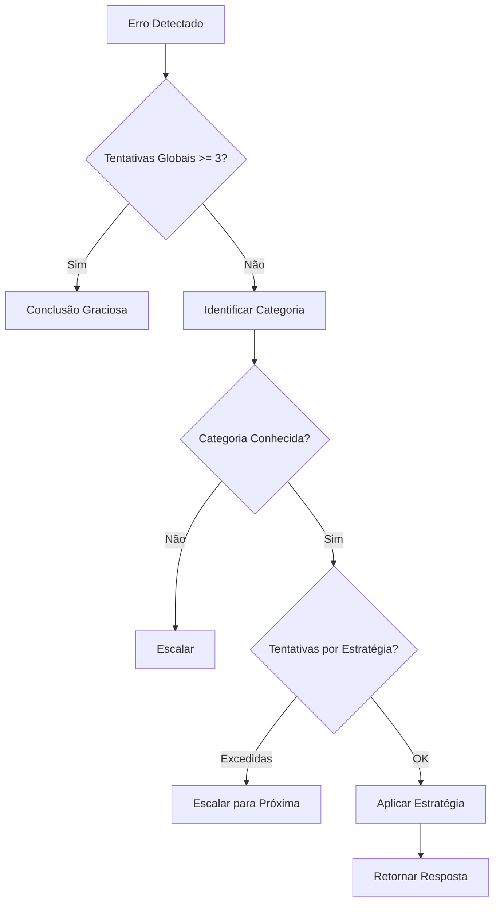

# 🔁 Retry Engine v4.0 - Documentação Técnica

## 📋 Visão Geral

O módulo **retryEngine.ts** implementa o sistema de recuperação inteligente e reavaliação de pipeline do SYNDICATE v3.1. Ele monitora falhas durante a execução do pipeline e aplica protocolos de retry apropriados baseados no tipo de erro, etapa afetada e especialista envolvido.

### Características Principais:
- **Categorização inteligente de falhas** - 7 categorias com estratégias específicas
- **Limites adaptativos** - Controle por estratégia e global
- **Cooldown progressivo** - Aumenta com tentativas sucessivas
- **Integração nativa** - Com RuntimeExecutionContext e pipeline
- **Decisões contextuais** - Baseadas em confiança e histórico

## 🎯 Como o Módulo Funciona

### 1. **Detecção e Categorização de Falhas**

O módulo identifica 7 categorias principais de falha:

```typescript
CATEGORIAS_FALHA = {
  INSUFFICIENT_CONTEXT      // Contexto insuficiente (< 60% confiança)
  LOGICAL_INCONSISTENCY     // Contradições ou falhas lógicas
  CROSS_SPECIALIST_CONFLICT // Conflitos entre especialistas
  EXPERTISE_GAP            // Análise fora do domínio disponível
  RESOURCE_EXHAUSTION      // Recursos esgotados ou timeout
  SYSTEM_INTEGRATION       // Falhas de módulos ou integração
  TIMEOUT_ANALISE         // Timeouts específicos de análise
}
```

### 2. **Estratégias de Recuperação**

Cada categoria tem uma estratégia específica:

- **qa_refinement_activation** → Enriquece contexto via Q&A
- **logic_reconstruction** → Reconstrói cadeia de raciocínio
- **structured_mediation** → Media conflitos entre especialistas
- **expertise_workaround** → Contorna lacunas com analogias
- **graceful_conclusion** → Consolida com dados disponíveis
- **methodology_fallback** → Simplifica abordagem
- **adjust_and_retry** → Ajusta parâmetros e tenta novamente

### 3. **Limites e Escalação**

```typescript
LIMITES_GLOBAIS = {
  MAX_TENTATIVAS_GLOBAL: 3,        // Máximo global
  MAX_TENTATIVAS_POR_ESTRATEGIA: 2, // Por estratégia
  COOLDOWN_MULTIPLICADOR: 1.5,      // Aumenta cooldown
  CONFIANCA_MINIMA_ACEITAVEL: 40   // Threshold mínimo
}
```

## 📦 Tipos Exportados

### RetryInput
```typescript
export interface RetryInput {
  etapaAtual: string;              // Ex: "coleta_evidencias"
  tipoErro: string;                // Ex: "timeout_analise"
  especialista?: string;           // Ex: "Senku"
  tentativaAtual: number;          // 1, 2, 3...
  confiancaAtual?: number;         // 0-100
  contextoErro?: Record<string, any>;
  tentativasGlobais?: number;
}
```

### RetryResponse
```typescript
export interface RetryResponse {
  acao: 'repetir' | 'pular' | 'ajustar' | 'reiniciar' | 'escalar' | 'concluir_gracioso';
  proximaEtapa?: string;
  justificativa: string;
  cooldownMs?: number;
  estrategiaRecuperacao?: string;
  modificacoes?: {
    ajusteConfianca?: number;
    especialistasAlternativos?: string[];
    simplificacoes?: string[];
  };
}
```

## 🔧 Funções Principais

### avaliarRetry(input: RetryInput): RetryResponse
Função principal que avalia a situação e retorna a estratégia de recuperação.

```typescript
const resultado = avaliarRetry({
  etapaAtual: 'coleta_evidencias',
  tipoErro: 'timeout_analise',
  especialista: 'Senku',
  tentativaAtual: 2,
  confiancaAtual: 35
});
```

### avaliarForcaConclusao(tentativasGlobais, confiancaAtual?, tempoDecorrido?): boolean
Determina se deve forçar conclusão baseado em múltiplos fatores.

```typescript
const deveConcluir = avaliarForcaConclusao(3, 25, 300000);
// true se: tentativas >= 3 OU confiança < 25% OU tempo > 5min
```

### aplicarModificacoesRetry(context, resposta): Promise<void>
Aplica as modificações sugeridas no contexto de execução.

```typescript
await aplicarModificacoesRetry(context, resposta);
// Ajusta confiança, ativa especialistas, aplica cooldown, etc.
```

## 📊 Exemplos de Uso

### Exemplo 1: Timeout de Análise
```typescript
import { avaliarRetry } from './retryEngine';

const result = avaliarRetry({
  etapaAtual: 'coleta_evidencias',
  tipoErro: 'timeout_analise',
  especialista: 'Senku',
  tentativaAtual: 2
});

console.log(result);
// {
//   acao: 'ajustar',
//   proximaEtapa: 'coleta_evidencias',
//   justificativa: 'Timeout detectado. Instruções de reanálise devem ser alteradas.',
//   cooldownMs: 2250, // 1500 * 1.5
//   estrategiaRecuperacao: 'adjust_and_retry',
//   modificacoes: {
//     simplificacoes: ['analise_focada', 'reducao_escopo', 'timeout_estendido']
//   }
// }
```

### Exemplo 2: Conflito entre Especialistas
```typescript
const result = avaliarRetry({
  etapaAtual: 'validation',
  tipoErro: 'specialist_conflict',
  especialista: 'estrategista_chefe',
  tentativaAtual: 1,
  confiancaAtual: 78
});

// Resultado: ativação de mediação estruturada com Obi
```

### Exemplo 3: Limite Global Atingido
```typescript
const result = avaliarRetry({
  etapaAtual: 'synthesis',
  tipoErro: 'low_confidence',
  tentativaAtual: 2,
  tentativasGlobais: 3, // Limite global!
  confiancaAtual: 45
});

// Resultado: conclusão graciosa forçada
```

### Exemplo 4: Integração com RuntimeExecutionContext
```typescript
import { RuntimeExecutionContext } from './types/common';
import { avaliarRetry, aplicarModificacoesRetry } from './retryEngine';

// Durante execução do pipeline...
async function handleError(context: RuntimeExecutionContext, error: Error) {
  const retryInput = {
    etapaAtual: context.etapa,
    tipoErro: error.message,
    especialista: context.especialista,
    tentativaAtual: context.tentativaAtual || 1
  };
  
  const resposta = avaliarRetry(retryInput);
  
  // Aplicar modificações automaticamente
  await aplicarModificacoesRetry(context, resposta);
}
```

## 🔄 Fluxo de Decisão



## 🛡️ Regras de Negócio

### 1. **Hierarquia de Escalação**
```
INSUFFICIENT_CONTEXT → EXPERTISE_GAP → GRACEFUL_CONCLUSION
LOGICAL_INCONSISTENCY → CROSS_SPECIALIST_CONFLICT → METHODOLOGY_FALLBACK
CROSS_SPECIALIST_CONFLICT → METHODOLOGY_FALLBACK → GRACEFUL_CONCLUSION
```

### 2. **Cooldown Progressivo**
- Base: 500ms - 3000ms (por categoria)
- Multiplicador: 1.5x por tentativa
- Fórmula: `base * (1.5 ^ (tentativa - 1))`

### 3. **Decisões de Conclusão Forçada**
- Tentativas globais >= 3
- Confiança < 25% após 2 tentativas
- Tempo decorrido > 5 minutos
- Comando explícito do usuário

## 🔌 Integração com Pipeline

### Com triggerEngine.ts
```typescript
// Trigger detecta falha e chama retry engine
if (confidence < CONFIDENCE_THRESHOLDS.CONCERNING_LOW) {
  const retry = avaliarRetry({
    etapaAtual: context.etapa,
    tipoErro: 'low_confidence',
    tentativaAtual: 1,
    confiancaAtual: confidence
  });
  
  if (retry.acao !== 'concluir_gracioso') {
    await aplicarModificacoesRetry(context, retry);
  }
}
```

### Com runtimeOrchestrator.ts
```typescript
// Orquestrador usa retry engine para decisões
catch (error) {
  const shouldRetry = await handleRetryLogic(context, error);
  if (!shouldRetry) {
    context.haltPipeline('Max retries exceeded');
  }
}
```

## 📈 Métricas de Performance

O módulo rastreia:
- **Taxa de recuperação por categoria** - Sucesso de cada estratégia
- **Tempo médio de recuperação** - Por tipo de erro
- **Tentativas até sucesso** - Distribuição estatística
- **Estratégias mais efetivas** - Por contexto

## ⚠️ Considerações Importantes

1. **Não abuse do retry** - Respeite limites globais
2. **Monitore confiança** - Abaixo de 40% é crítico
3. **Use cooldowns** - Evite sobrecarga do sistema
4. **Documente falhas** - Para aprendizado contínuo
5. **Teste edge cases** - Especialmente limites

## 🚀 Melhores Práticas

1. **Sempre forneça contexto completo** no RetryInput
2. **Use tentativasGlobais** para evitar loops infinitos
3. **Implemente logging** com gerarRelatorioRetry()
4. **Teste diferentes categorias** de erro
5. **Monitore métricas** para otimização

## 🔮 Evolução Futura

Possíveis melhorias:
- Machine learning para prever falhas
- Estratégias customizáveis por caso
- Retry assíncrono com queue
- Análise preditiva de sucesso
- Dashboard de monitoramento

---

**Versão**: 4.0.0  
**Compatibilidade**: SYNDICATE v3.1+  
**Dependências**: types/common.ts